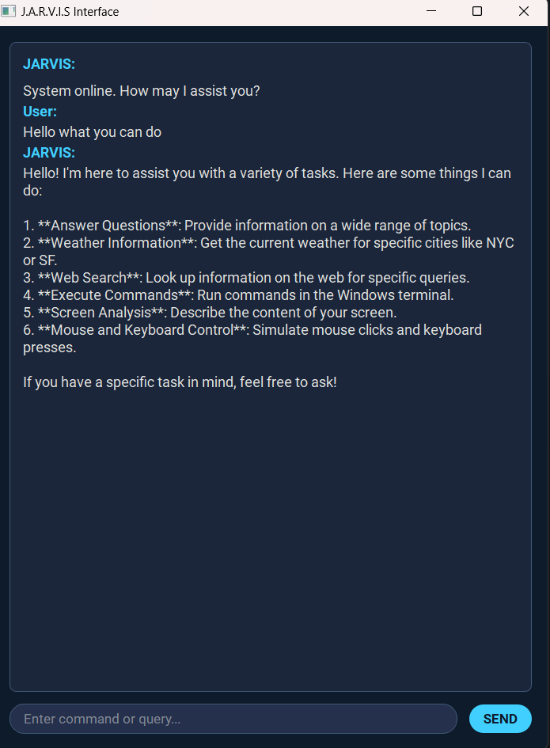

# Jarvis - Advanced AI Assistant

Jarvis is an AI assistant built using LangGraph and PyQt5 that can perform a variety of tasks through natural language commands, including web searches, file operations through terminal commands, reading the screen, and interacting with UI elements.

## Features

- **Natural Language Interface**: Interact with your computer using conversational language
- **Screen Reading**: Analyze and describe the content currently visible on your screen.
- **UI Automation**: Click buttons, type text, and press keys based on screen content or coordinates.
- **Terminal Command Execution**: Execute Windows terminal commands for file and system operations
- **Web Search**: Search the web for up-to-date information
- **Conversation Memory**: Jarvis remembers context from previous interactions
- **Futuristic UI**: Modern, dark-themed interface with streaming responses
- **Direct Terminal Access**: Built-in terminal emulator for direct command execution

## Requirements

- Python 3.8+
- OpenAI API key
- Tavily API key (for web search)

## Installation

1. Clone this repository
2. Install the required packages:
   ```
   pip install -r requirements.txt
   ```
3. Set up your API keys in the `.env` file:
   ```
   OPENAI_API_KEY=your_openai_api_key
   TAVILY_API_KEY=your_tavily_api_key
   ```

## Usage

### GUI Version (Recommended)

Run Jarvis with the modern GUI interface:

```
python jarvis_ui.py
```

The GUI provides:

- Chat interface for interacting with Jarvis
- Terminal emulator for direct command execution
- Popup confirmations for sensitive operations
- Status indicators and real-time response streaming

### Command Line Version

If you prefer a command-line interface:

```
python jarvis.py
```

### Example Commands

You can ask Jarvis to:

1. **Run Terminal Commands**:

   - "List the files in the current directory"
   - "Read the content of file.txt"
   - "Create a new folder called 'projects'"
   - "Delete the file named 'temp.txt'"

2. **Search the Web**:

   - "Search for the latest news about artificial intelligence"
   - "Find information about Python programming"

3. **General Questions**:

   - "What is the capital of France?"
   - "How do I create a Python virtual environment?"

4. **Screen Interaction (Requires careful use and potentially specific coordinates from screen description):**
   - "Describe my screen" (or "Read the screen")
   - "Click the button near the center" (Agent needs coordinates from description)
   - "Click at coordinates 500, 300"
   - "Type 'hello world' into the selected field" (Make sure field is selected first)
   - "Press the enter key"

### Security Features

For any operations that modify your system (like deleting files or writing to files), Jarvis will ask for your confirmation before proceeding. In the GUI version, this appears as a popup dialog:


## UI Overview

The Jarvis UI is divided into two main sections:

1. **Chat Panel (Left)**: Interact with Jarvis using natural language

   - Type your questions or commands in the input box
   - View Jarvis's responses in the chat area
   - Watch as responses stream in real-time

2. **Terminal Panel (Right)**: Direct command execution
   - Execute terminal commands directly
   - View command output
   - Type 'help' for a list of common commands



## Extending Jarvis

You can extend Jarvis by adding more tools in the `tools` directory (like `screen_reader.py` and `ui_automation.py`) and importing them in `jarvis.py`. The system is designed to be modular and easy to customize.

### Adding Voice Support

Voice support is planned for a future release. The codebase is designed to make this integration straightforward.

### Future Enhancements

- **Voice Interaction**: Enabling voice commands and responses.
- **Enhanced UI Automation**: Improving the ability to identify and interact with specific UI elements reliably.
- **Cross-Platform Support**: Exploring compatibility with macOS and Linux.
- **Plugin System**: Allowing for easier integration of third-party tools and capabilities.

## Troubleshooting

- **Web Search Not Working**: Make sure you have set up your Tavily API key correctly in the `.env` file.
- **GUI Issues**: Ensure PyQt5 and all UI dependencies (including `pyautogui` for UI automation) are installed correctly.
- **Command Execution Issues**: Some commands might require administrator privileges. Try running Jarvis with elevated permissions if needed.
- **UI Automation Issues**: Screen interaction depends heavily on the vision model accurately describing elements and their locations. Coordinate-based clicking requires knowing the exact coordinates. Ensure the correct window/element is focused before typing or pressing keys.
- **Model Response Issues**: Adjust the model parameters in `jarvis.py` if you need different response styles or capabilities.

## License

This project is licensed under the MIT License - see the LICENSE file for details.

## Acknowledgments

- Built using LangGraph, LangChain, PyQt5, and PyAutoGUI
- Created by Rahees Ahmed
